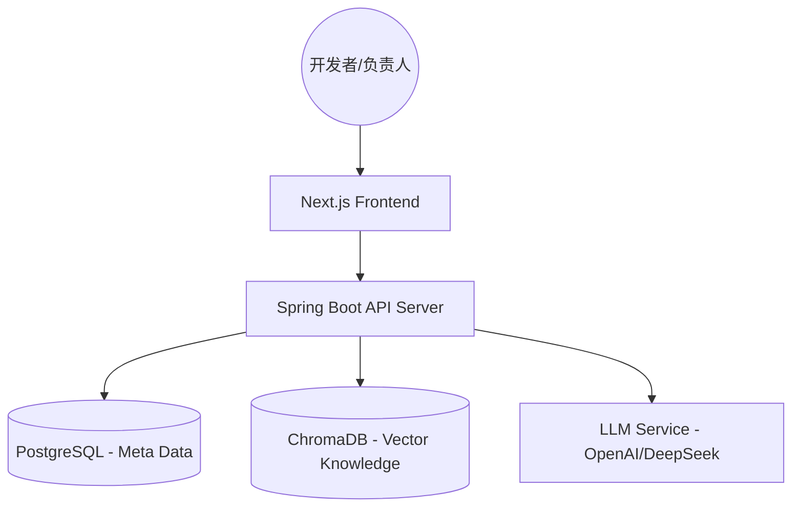

# SpecGuard 架构设计文档

## 1. 总体架构概览
SpecGuard 采用 C/S 架构，前端为基于 Next.js 的响应式 Web 应用，后端基于 RAG (Retrieval-Augmented Generation) 架构实现智能化代码评审。

### 系统架构图

## 2. 技术栈选择
| 组件 | 技术选型 | 理由 |
| :--- | :--- | :--- |
| **前端** | Next.js, Tailwind CSS, Shadcn UI | 快速构建响应式、现代化 UI |
| **后端** | Spring Boot 3.x, Spring AI | 成熟的 Java 生态，易于集成 AI 与企业级功能 |
| **数据库** | PostgreSQL | 存储用户信息、项目、审核历史等结构化数据 |
| **向量数据库** | ChromaDB / Webbase | 存储规范文档的向量索引，支持语义检索 |
| **AI 模型** | DeepSeek / GPT-4o | 强大的代码理解与规范对齐能力 |
| **部署** | Docker, Docker Compose | 简化环境安装与一致性保障 |

## 3. 核心业务流程

### 3.1 知识库建库流程 (RAG Ingestion)
1. **上传**: 用户通过 Web 上传 Markdown 或文本规范。
2. **切分**: 系统对文档进行语义切分（按章节或固定 Token 窗口）。
3. **向量化**: 调用 Embedding 模型将文本片段转为向量。
4. **存储**: 将向量及原始文本存入向量数据库，并与项目绑定。

### 3.2 智能评审流程 (RAG Inference)
1. **提交**: 开发者提交待评审的 Java 代码。
2. **检索**: 系统提取代码语义，从对应的规范集中检索最相关的规则片段。
3. **组装**: 将代码、规则片段及评审指令组装成 Prompt。
4. **推理**: 调用 LLM 生成结构化评审结果。
5. **呈现**: 前端解析结果，高亮显示违反规范的条款及修改方案。

## 4. 关键技术点
- **语义切分策略**: 为了保证检索精度，系统需要根据 Java 规范的特点（如：排版、分级）进行智能分段。
- **混合检索**: 结合语义检索与关键词检索，确保特定术语的准确识别。
- **Prompt 工程**: 定义严格的 JSON 输出格式，方便后端解析并提供前端交互（如：“一键修复”预览）。
