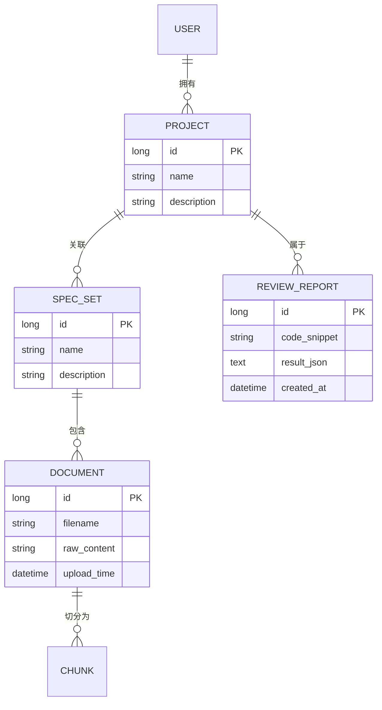

# SpecGuard 技术详细设计文档

## 1. 数据模型设计
系统采用关系型数据库 (PostgreSQL) 存储元数据，与向量数据库 (ChromaDB) 存储知识内容。

### 1.1 实体关系模型 (ERD)


### 1.2 向量存储 Schema
- **Collection 名称**: `spec_chunks`
- **Metadata**: 
    - `project_id`: 关联项目
    - `document_id`: 来源文档
    - `spec_set_id`: 所属规范集
- **Document**: 文本片段原始内容
- **Embedding**: 768 或 1536 维向量

## 2. API 接口设计 (核心)

### 2.1 知识库管理
- `POST /api/v1/spec-sets`: 创建规范集
- `POST /api/v1/spec-sets/{id}/documents`: 上传并索引文档
- `GET /api/v1/projects/{id}/specs`: 获取项目关联的所有规范

### 2.2 内部服务通信 (Java -> Python)
Java 后端通过 `WebClient` 调用 Python Workflow Engine 的 API。
- `POST /workflow/review`: 触发完整的代码评审工作流。
    - **请求**: `{ projectId: long, code: string }`
    - **处理**: Python 端负责检索向量库、组装 Prompt、调用 LLM。
    - **响应**: 结构化的评审建议 JSON。

### 2.3 知识库管理
- `POST /api/v1/spec-sets/{id}/documents`: Java 接收文件并存储至 OSS，随后通知 Python 端进行异步切分与向量化。

## 3. RAG 详细逻辑与 Prompt 设计

### 3.1 检索策略
1. **语义编码**: 使用 `text-embedding-3-small` 或同级开源模型对用户提交的代码片段进行编码。
2. **相似度搜索**: 在对应项目的 `spec_chunks` 集合中执行 Cosine Similarity 搜索。
3. **重排序 (Rerank)**: (可选) 对初筛结果进行重排序，提高准确率。

### 3.2 Prompt 模板
```text
你是一个专业的 Java 架构师，请根据提供的【团队规范】对【代码片段】进行评审。

【团队规范】:
{retrieved_chunks}

【代码片段】:
{user_code}

【评审要求】:
1. 必须指出违反了哪一条团队规范。
2. 若有通用代码质量问题（如：圈复杂度过高、空指针风险）一并指出。
3. 请按以下格式返回 JSON:
{
  "issues": [
    {
      "severity": "CRITICAL/WARNING",
      "rule_reference": "规范原文",
      "description": "问题描述",
      "suggestion": "修改建议",
      "fixed_code": "修复后的代码示例"
    }
  ]
}
```

## 4. AI Workflow Engine (Python)
作为系统的“大脑”，Python 端不再仅仅是简单的 API 包装，而是负责复杂的逻辑编排。

### 4.1 工作流编排 (Workflow Orchestration)
使用 **LangGraph** 或状态机模式定义评审流：
1. **Input Analysis**: 分析代码语言、长度和上下文需求。
2. **Dynamic Retrieval**: 根据分析结果，从向量库中多轮检索相关规范。
3. **Reasoning & Review**: 调用 LLM 进行深度评审。
4. **Self-Correction**: (Edge Case) 若生成格式错误，反向提示 LLM 修复 JSON。

### 4.2 为什么选择 Python 编写工作流？
- **生态优势**: LangChain/LangGraph 提供了极其成熟的“智能体 (Agent)”和“长链任务”管理工具。
- **灵活性**: 复杂的 RAG 涉及多轮检索、重排序 (Rerank) 和条件判断，Python 的语法表达力更适合描述这些非线性逻辑。

## 5. 安全与性能优化
- **鉴权**: 使用 JWT 进行 API 鉴权。
- **异步处理**: 文档向量索引与代码评审均采用异步队列处理，提升用户体验。
- **缓存**: 对重复代码片段的评审结果进行 Redis 缓存。
