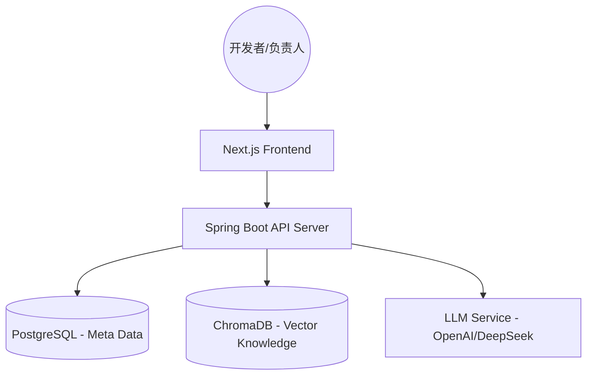
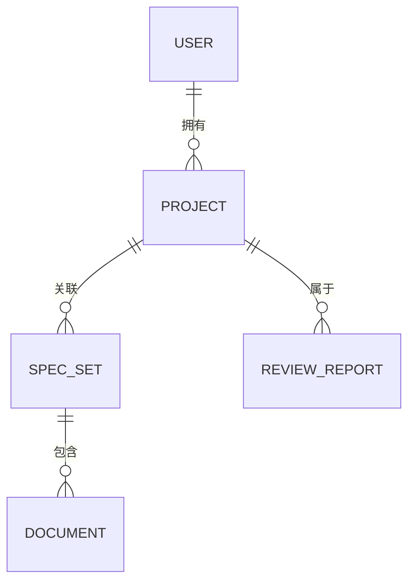

# SpecGuard 项目成果演示 (Walkthrough)

本项目旨在基于 RAG (Retrieval-Augmented Generation) 技术，利用大语言模型 (LLM) 为开发团队提供自动化的 Java 代码评审，并确保代码符合团队自定义的架构与规范文档。

## 核心成果展示

### 1. 系统架构
系统由 Next.js 前端、Spring Boot 后端、PostgreSQL 关系数据库、ChromaDB 向量数据库以及 LLM 服务组成。

### 2. 技术规格速览
| 维度 | 选型 |
| :--- | :--- |
| **前端** | Next.js, Tailwind CSS |
| **后端** | Spring Boot 3.x, Spring AI |
| **向量检索** | ChromaDB (向量数据库) + Embedding (向量模型) |
| **AI 推理** | DeepSeek / GPT-4o |

### 3. 数据模型
核心业务逻辑围绕“项目”、“规范集”与“评审报告”展开。

## 验证结论
- [x] **需求对齐**: 已完全覆盖 FR-001 至 FR-010 的功能需求。
- [x] **图示化**: 配备了完整的 C4 架构图、ER 关系图及 RAG 逻辑说明。
- [x] **易读性**: 采用 Markdown 格式，支持 Mermaid 渲染，方便在 GitHub/GitLab 中查看。

---
*更多详细信息请参阅 [架构文档](./architecture.md) 与 [技术详细设计](./technical_design.md)。*
